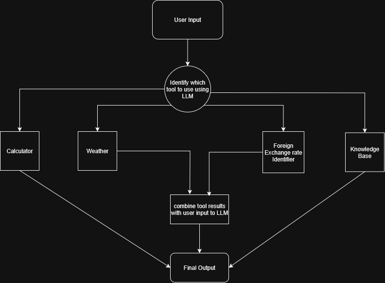

# Refactor & Extend: Simple Tool-Using Agent

**Goal:** Turn a brittle, partially working agent into production-quality code, then extend it with a new tool and real tests.

---
You must **refactor for robustness**, **add one new tool** (translator / unit converter), and **add proper tests**.
---

## Your Tasks (Summary)

1. **Refactor**
2. **Improve**
3. **Add ONE new tool** 
4. **Write tests**
5. **Improve Documentation**

See the assignment brief for full details (shared in the job post).

---

## Quick Start

### Python 3.10+ recommended

```bash
python -m venv .venv
source .venv/bin/activate  # Windows: .venv\Scripts\activate
pip install -r requirements.txt
```

### Run

```bash
python main.py "What is 12.5% of 243?"
python main.py "Summarize today's weather in Paris in 3 words"
python main.py "Who is Ada Lovelace?"
python main.py "Add 10 to the average temperature in Paris and London right now."
```

### Test

```bash
pytest -q
```

> Note: The fake LLM sometimes emits malformed JSON to simulate real-world flakiness.

---

## What we expect you to change

- Split responsibilities into modules/classes.
- Add a schema for tool plans; validate inputs and tool names.
- Make tool calls resilient and typed;
- Add one new tool and tests that prove your design is extensible.
- Update this README with an architecture diagram (ASCII ok) and clear instructions.
- You can use Real LLMs or a fake one, but ensure your code is robust against malformed responses.

Good luck & have fun!

## Architecture



## Overview
This project demonstrates an AI agent that interprets user queries to identify the appropriate tools via a language model (LLM) and combines the results from these tools with the LLM to generate accurate, reliable, and non-hallucinated responses.

## Tools

1. **Calculator**
   Safely evaluates arithmetic expressions using abstract syntax tree    
   Supports: `+`, `-`, `*`, `/`, `%`, `**`, `//`.

2. **Weather**  
   Fetches current weather for a list of cities using the Open-Meteo API.  
   Returns: temperature, wind speed, and description.

3. **Knowledge Base**  
   Searches `data/kb.json` using sentence embeddings.  
   Returns the summary of the most similar entry.

4. **Foreign Exchange Rates (newly added tool)**  
   Retrieves conversion rates from exchangerate-api.com.  
   Supports multiple base and target currencies.

### Large Language Model (LLM)

- **Model:** `gpt-oss-20b:free`  
- **Provider:** OpenRouter API via `openai` Python client  
- **Purpose in this project:**  
  1. Determine which tool to use for a given user query.  
  2. Combine results from tools ( Weather and FX) into a coherent, trustworthy answer.  
- **Behavior:** Deterministic output with `temperature=0` to avoid hallucinations.  
- **Notes:**  
  - Only used for planning and combining tool outputs.  
  - Sensitive operations like math evaluation, current exchange rates, current weather are **not executed by the LLM**, but by safe tools in Python (e.g., `ast` for calculations) or by calling Api's.

  ### API Keys

This project requires API keys for some tools:

1. **OpenRouter / OpenAI API Key**  
   - Used by the LLM (`gpt-oss-20b:free`) for tool planning and result combination.  
   - Environment variable: `OPENAI_API_KEY`  

2. **Exchangerate-API Key**  
   - Used by the Foreign Exchange tool to fetch conversion rates.  
   - Environment variable: `EXCHANGERATE_API_KEY`  

### Workflow

The AI-Agent follows a structured workflow from receiving a user query to producing the final output:

1. #### Command Line Input  
   The user runs the program via `main.py`:

   ```bash
   python main.py "Your question here"
#### 2.Main Function
- Parses the command line input.
- Passes the query string to the `Agent` class in `orchestrator.py`.

#### 3.Agent / Orchestrator
- Calls the **Planner** (`plan_tool`) to determine which tool to use.
- Receives a plan with:
  - `tool`: the selected tool name (`calculator`, `weather`, `knowledgebase`, etc.)
  - `args`: the arguments for that tool.

#### 4.Tool Execution
- The `Agent` fetches the corresponding Tool class using `get_tool(tool_name)`.
- Validates and parses the arguments using the tool’s `args_model` (Pydantic schema).
- Executes the tool's `run()` method:
  - **CalculatorTool**: evaluates arithmetic expressions.
  - **WeatherTool**: fetches weather via Open-Meteo API.
  - **KnowledgeBaseTool**: finds the most relevant entry from `data/kb.json`.
  - **FXTool**: retrieves currency exchange rates from exchangerate-api.com.

#### 5.Result Handling
- The tool returns a `ToolResult` with:
  - `ok`: whether execution succeeded.
  - `data`: the result of the tool.
  - `error`: error message (if any).

#### 6.LLM Combination (if needed)
- For tools like Weather and Foreign exchange rates the result is combined with the original query using the LLM (`combine_with_llm`).
- Produces a concise, non-hallucinated final answer.

#### 7.Output
- The final answer is printed to the console.